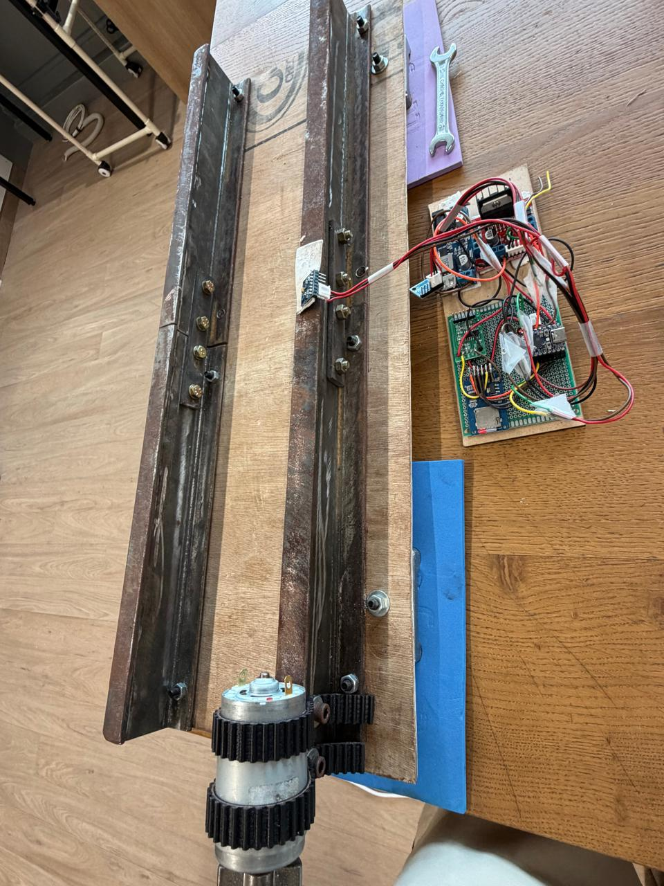
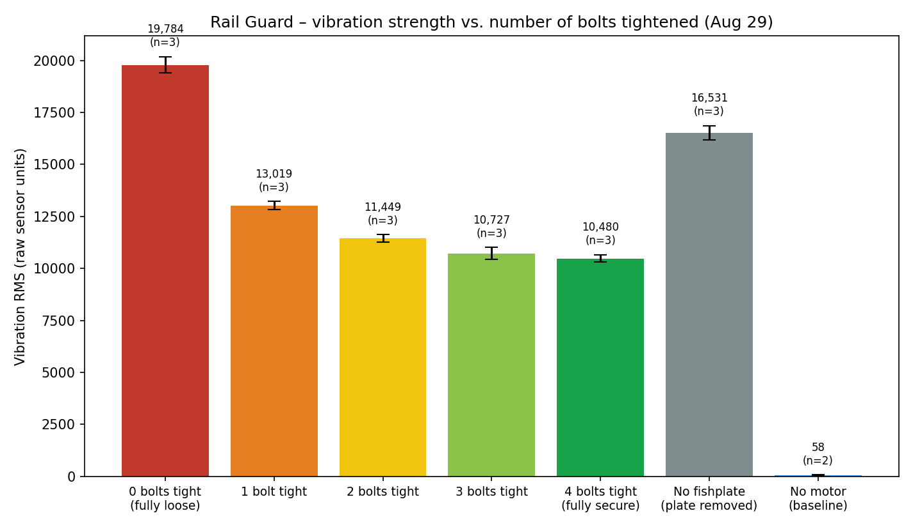

# Rail-Guard 🚆

### Can a train tell when a railway bolt is getting loose?

A railway joint is held together by a few bolts. Trains go over it thousands of times, the rail vibrates, and eventually those bolts can start to loosen.

I wanted to know if that change could be **heard through the rail**.

So I built a small railway joint in my workshop, put an accelerometer on it, and started shaking it.

That became **Rail-Guard**.

**IBDP Extended Project — Mohit Sheth**

---

## The idea

The idea is pretty simple:

**Train passes → rail vibrates → sensor records it → look for a difference between tight and loose joints.**

If that difference is large enough and consistent enough, a sensor on a train could potentially flag a joint for closer inspection.

I'm not trying to build a railway inspection system in my bedroom. The current version is a **bench-scale experiment** to find out whether the basic idea is even worth pursuing.

---

## What I built

I couldn't find a small piece of actual railway track that worked for the experiment, so I made one.

The prototype has:

* A **24-inch steel rail section**
* A real **bolted fishplate joint**
* An **ESP32-S3**
* An **MPU-6050/6500 accelerometer**
* A motor to create repeatable vibration
* **MicroSD storage**
* An **HX711 + load cell** for measuring bolt force later
* Python tools for saving and looking at the data

The ESP32 can sample the accelerometer at about **1 kHz**, save the readings, and run an FFT to look at the vibration frequencies.

The rail and its fishplate joint on the left, the motor that stands in for a passing train at the bottom, and the ESP32 + sensor board on the right — soldered onto perfboard and wired up rather than breadboarded.

---

## Then things started going wrong

My first plan was to look for a change in the rail's natural frequency when a bolt was loosened.

I did the calculations.

The problem was that the frequencies I got went as high as about **17 kHz**, while my accelerometer could only reliably measure up to about **500 Hz**.

So my sensor basically couldn't hear the thing I had originally planned to measure.

That was the first major change to Rail-Guard. I stopped looking for a change in the rail's natural frequency and started looking at how the **joint itself moves** when the bolts are loose.

Then I found another problem.

The wooden board holding the track was moving slightly when the motor ran.

That meant some of my "rail vibration" was actually just the entire experiment moving around.

So I clamped the board down and threw the old results into a separate folder instead of pretending they were good.

That's where the project is right now: **collecting a cleaner dataset and finding out whether tight and loose joints actually look different in the data.**

---

## Current status

* ✅ Rail prototype built
* ✅ Fishplate joint built
* ✅ ESP32-S3 working
* ✅ Accelerometer sampling working
* ✅ SD card logging working
* ✅ Live FFT working
* ✅ Motor vibration detected
* ✅ Board movement found and fixed
* 🔄 Tight vs. loose testing
* 🔄 Bolt-force measurements
* ⏳ Fault detection

The important part is that I **don't have the final answer yet**.

The current experiment is trying to answer one thing:

> **Can I reliably tell a tight joint from a loose one using vibration?**

If the answer is yes, the next step is figuring out how reliable the detection is.

If the answer is no, I need to figure out why.

---

## First look at the data

With the clamped-board fix in, I ran the full test: three stationary baselines, then three one-minute runs at every bolt state from 0 through 4 bolts tightened, plus three runs with the fishplate removed entirely.

The average vibration drops in a clean, consistent line as more bolts go in, and the three repeats at each state agree closely with each other. The gap between badly loose (0–1 bolts) and reasonably secure (3–4 bolts) is large and easy to see. The gap between 3 bolts and 4 bolts is not — smaller than the normal run-to-run noise, so the sensor can tell "loose" from "tight" but not yet "tight" from "perfectly tight." That's an early, encouraging sign for the core question above, not a final answer.

---

## Why I'm interested in it

Railway inspection already exists. There are dedicated inspection vehicles and other ways of checking track.

What interested me was a different possibility:

**What if the train doing its normal journey could collect some of that information itself?**

A cheap sensor wouldn't replace proper railway inspection. But if it could flag a suspicious joint, it might give engineers another piece of information and help point them towards where to look.

For now, I'm trying to get one small steel joint on a table to give me a trustworthy answer.

That's hard enough.

---

## Go through the project

I kept the messy parts of the project instead of deleting them. The calculations, failed tests, old data, wiring, photos, logbook and presentations are all in the repository.

| Folder | What's inside |
| ------------------------------------------------ | -------------------------------------------------------- |
| [`analysis/`](analysis/) | Data collection and rail-frequency calculations |
| [`code/`](code/) | ESP32 tests, data collection and experimental datasets |
| [`docs/`](docs/) | The actual design, theory, build process and problems |
| [`hardware/`](hardware/) | Schematics, drawings, BOM and 3D model |
| [`logbook/`](logbook/) | My project logbook |
| [`media/`](media/) | Photos and videos |
| [`presentations/`](presentations/) | Project presentations |
| [`specification_sheets/`](specification_sheets/) | Datasheets for the components |

If you only have a few minutes, start here:

**[`docs/PROBLEMS.md`](docs/PROBLEMS.md)** — probably the most honest part of the project.

---

## One thing I'm still trying to find out

**Can a cheap accelerometer tell me that a railway joint is getting loose before I can see the problem?**
